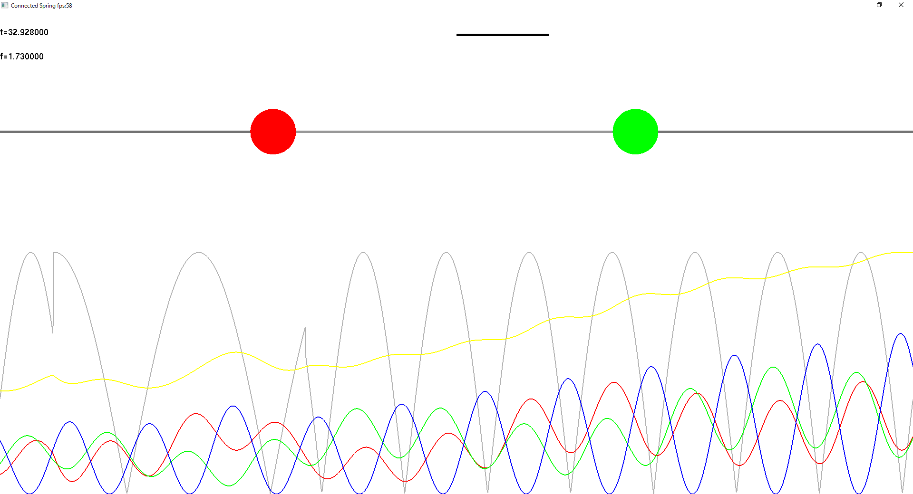

ConnectedSpring
===============

バネの連成振動を可視化するために作成しました。バネの連成振動は物理の非常に基本的なモデルで、量子力学の固有状態の理解も状態が本質的に波で記述できる領域に限った現象は連成振動のアナロジーで考えることができます。

量子エレクトロニクスの中でも原子物理/量子光学の領域において知られる、電磁誘起透明化 (Electromagnetic induced transparency, EIT) という現象や外界の操作に対し頑強な部分空間を直感的に理解することができます。また、ばねの連結震動で書けない現象を考えることで波動性と粒子性が同時に寄与する現象とは何かを考えることができます。

作成にはWindows Presentation Foundation (WPF)を用いているのでVisual Studioでビルドしてください。
